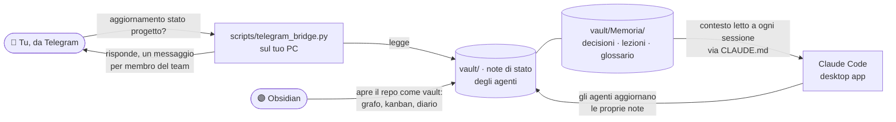

# Guida passo passo — Rete di agenti visibile (Obsidian + Telegram + Memoria)

Questa guida spiega come trasformare la rete di agenti del progetto *Lanterna*
in qualcosa di **visibile e interrogabile**: un vault Obsidian che mostra il
lavoro come grafo, un "gruppo" Telegram dove il team risponde solo quando lo
chiedi tu, e una memoria condivisa che cresce nel tempo.

Tutta l'impalcatura è **già nel repo**: devi solo installare due app e
incollare due token. Tempo stimato: 30–40 minuti.

## Architettura d'insieme



Il punto di incontro di tutto è la cartella `vault/`: gli agenti ci scrivono,
Obsidian la visualizza, Telegram la legge. Nessun servizio esterno, nessun
abbonamento: sono solo file markdown nel tuo repo.

---

## Parte 1 — La rete di agenti (già fatta ✅)

Gli agenti vivono in `.claude/agents/` e ora hanno una regola in più nel loro
prompt: **alla fine di ogni sessione di lavoro aggiornano la propria nota di
stato** in `vault/Agenti/` e registrano le decisioni in `vault/Memoria/`.
È questo che rende la rete "visibile": ogni volta che un agente lavora,
lascia una traccia leggibile da Obsidian e da Telegram.

Non devi fare nulla qui, se non ricordarti che quando lavoriamo nella desktop
app puoi sempre dire *"aggiornate le vostre note di stato"* se un agente se
ne fosse dimenticato.

---

## Parte 2 — Obsidian: il grafo del progetto

### Passo 1 · Installa e apri il vault
1. Scarica Obsidian da [obsidian.md](https://obsidian.md) (gratis).
2. All'avvio scegli **"Open folder as vault"** e seleziona la **cartella del
   repo clonato** (`prima-pr-demo`), non una sottocartella: così Obsidian
   vede `vault/` e `docs/` insieme e i link incrociati funzionano.

### Passo 2 · Impostazioni minime
1. `Settings → Files & Links → Default location for new notes` →
   `vault/` (così le note nuove non sporcano la radice del repo).
2. `Settings → Community plugins → Turn on community plugins`, poi installa:
   - **Kanban** — per la bacheca `vault/Bacheca Kanban.md` (trascini le task
     tra "Da fare / In corso / Fatto");
   - **Obsidian Git** *(facoltativo)* — fa commit e pull automatici del
     vault, utile se vuoi vedere da un altro dispositivo il lavoro fatto.

### Passo 3 · Il grafo
1. Apri la **Graph view** (icona a rete, o `Ctrl/Cmd+G`).
2. Nei filtri del grafo attiva i **Groups** e colora per cartella:
   `path:vault/Agenti` (il team), `path:vault/Task`, `path:docs`,
   `path:vault/Memoria`, `path:vault/Diario`.
3. Il grafo cresce da solo: ogni nota che gli agenti scrivono usa wikilink
   (`[[GDD]]`, `[[Game Designer]]`, `[[Faro]]`…), e ogni link è un arco nel
   grafo. Dopo qualche settimana avrai davvero la "rete gigante" del lavoro
   svolto, navigabile nodo per nodo.

### Cosa trovi già pronto nel vault
| Nota | A cosa serve |
|---|---|
| `vault/Home.md` | Dashboard di partenza, linka tutto |
| `vault/Agenti/*.md` | Una scheda per membro del team (tu compreso) con la sezione **Stato attuale** che alimenta Telegram |
| `vault/Bacheca Kanban.md` | Bacheca delle task, già popolata dal Gantt |
| `vault/Diario/` | Un log per data delle sessioni di lavoro |
| `vault/Memoria/` | La memoria a lungo termine (vedi Parte 4) |

---

## Parte 3 — Telegram: il "gruppo del team"

Obiettivo: un gruppo dove ci siete tu e gli agenti. Scrivi
**"aggiornamento stato progetto?"** e ricevi una risposta *da ogni membro*,
ciascuno con il proprio compito e a che punto sta. Il bot **non scrive mai di
sua iniziativa**: risponde solo al tuo trigger.

### Passo 1 · Crea il bot principale
1. Su Telegram apri **@BotFather** → `/newbot`.
2. Nome: `Lanterna PM`, username: qualcosa tipo `lanterna_pm_bot`.
3. Salva il **token** che ti dà (formato `123456789:AAF...`).
4. Sempre in BotFather: `/setprivacy` → scegli il bot → **Disable**.
   Serve perché il bot possa *leggere* i messaggi del gruppo (di default i
   bot nei gruppi sono sordi).

### Passo 2 · (Facoltativo ma scenografico) Un bot per ogni agente
Per l'effetto "siamo tutti nel gruppo", ripeti `/newbot` altre 4 volte:
`Lanterna Game Designer`, `Lanterna Programmatore`, `Lanterna Level Designer`,
`Lanterna Concept Artist`. Con BotFather puoi anche dare a ciascuno una foto
profilo (`/setuserpic`). Per questi bot **non** serve toccare la privacy:
devono solo scrivere, non leggere.

> Se salti questo passo funziona tutto lo stesso: risponderà il bot
> principale con un messaggio per agente, prefissato con nome ed emoji.

### Passo 3 · Crea il gruppo
1. Nuovo gruppo Telegram: "🎮 Team Lanterna".
2. Aggiungi il bot principale (e i 4 bot agente se li hai creati).

### Passo 4 · Configura e avvia il ponte
Sul PC, nella cartella del repo:

```bash
cp scripts/telegram_config.example.json scripts/telegram_config.json
# apri il file e incolla i token
python3 scripts/telegram_bridge.py
```

Il file di config è nel `.gitignore`: i token non finiranno mai su GitHub.

Alla prima esecuzione scrivi un messaggio qualsiasi con la parola
"aggiornamento" nel gruppo: lo script ti stampa a terminale il **chat_id**
del gruppo → incollalo nel config e riavvia. Da quel momento il ponte
risponde solo in quel gruppo.

### Passo 5 · Prova
Scrivi nel gruppo: **`aggiornamento stato progetto?`**
Riceverai un messaggio da ogni membro del team (te compreso — legge la tua
nota `vault/Agenti/3D Artist.md`!) con il contenuto della sua sezione
"Stato attuale".

### Modalità "riassunto intelligente" (facoltativa)
Nel config metti `"use_claude": true`: oltre agli stati, il ponte lancia
`claude -p` in locale e aggiunge un riassunto fresco del progetto scritto da
Claude leggendo `docs/` e `vault/`. Richiede la CLI di Claude Code installata
sul PC; costa una chiamata al modello per ogni richiesta, quindi è spenta di
default.

> ⚠️ Il ponte gira finché il PC è acceso (va benissimo lanciarlo quando
> lavori al progetto). Se un giorno lo vorrai sempre attivo, si sposta pari
> pari su un Raspberry Pi o un mini-VPS: è un singolo file Python senza
> dipendenze.

---

## Parte 4 — La memoria LLM del progetto

La "memoria gigante" è la cartella `vault/Memoria/` + il file `CLAUDE.md`
alla radice del repo, e funziona così:

1. **`CLAUDE.md`** viene letto automaticamente da Claude Code **a ogni
   sessione**: contiene l'identità del progetto e l'istruzione di consultare
   e aggiornare la memoria. È il ponte tra le sessioni: quello che scriviamo
   lì, io lo so sempre.
2. **`vault/Memoria/Decisioni.md`** — ogni scelta importante con data e
   motivazione (es. "Unity 6 invece di Godot"). Evita di ridiscutere le cose
   già decise.
3. **`vault/Memoria/Lezioni.md`** — cosa ha funzionato e cosa no. È il
   carburante per **migliorare gli agenti**: quando una lezione riguarda un
   ruolo ("il level designer fa liste asset troppo vaghe"), la trasformiamo
   in una riga nel suo prompt in `.claude/agents/`. Gli agenti migliorano
   letteralmente leggendo i propri errori.
4. **`vault/Memoria/Glossario.md`** — i termini del progetto, così ogni
   agente (e ogni nuova sessione) parla la stessa lingua.
5. **`vault/Diario/`** — un file per data: cosa è successo in ogni sessione.
   È l'archivio storico consultabile sia da te (in Obsidian, anche dal grafo)
   sia da me quando serve ricostruire il contesto.

Rituale consigliato (5 minuti a fine sessione): chiedimi *"chiudi la
sessione"* → aggiorno diario, note di stato e memoria, e faccio commit.
Così Telegram e Obsidian sono sempre allineati a costo zero per te.

---

## Checklist per stasera

- [ ] Clona il repo e apri la desktop app sul branch `claude/videogame-agent-network-zj4udu`
- [ ] Installa Obsidian → apri la cartella del repo come vault → plugin Kanban
- [ ] Apri la Graph view e colora i gruppi
- [ ] BotFather: bot principale (+ eventuali 4 bot agente) → token nel config
- [ ] `python3 scripts/telegram_bridge.py` → recupera il chat_id → prova "aggiornamento stato progetto?"
- [ ] Poi si parte col setup Unity 6 come da piano 🚀
