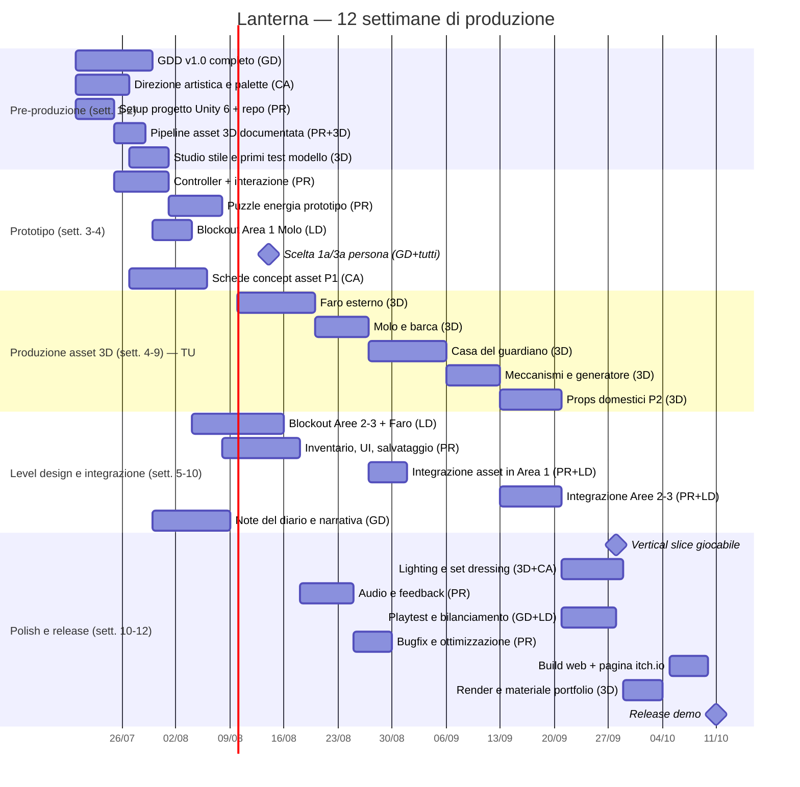

# Piano di produzione — *Lanterna*

Piano su **12 settimane** (part-time, ritmo sostenibile). Le date partono da
lunedì 20 luglio 2026; sposta tutto liberamente, contano le durate e le
dipendenze.

Ruoli: **GD** = game designer · **PR** = programmatore · **LD** = level
designer · **CA** = concept artist · **3D** = 3D artist (**tu**).

## Gantt

## Le tue task da 3D artist, in ordine

1. **Sett. 2**: leggi la direzione artistica del concept artist, fai 1–2
   modelli di prova per validare stile e pipeline di import in Unity.
2. **Sett. 4–5**: **Faro esterno** — l'hero asset. Prenditi il tempo che serve.
3. **Sett. 5–6**: molo e barca (prima inquadratura del gioco).
4. **Sett. 6–8**: casa del guardiano, esterno + interno.
5. **Sett. 8–9**: meccanismi, generatore, kit condotti del puzzle.
6. **Sett. 9–10**: prop set domestico (~15 pezzi piccoli).
7. **Sett. 10–11**: set dressing e lighting col concept artist.
8. **Sett. 11–12**: render belli, turntable e breakdown per il portfolio.

Ogni asset entra nel gioco appena pronto: il programmatore usa placeholder
fino a quel momento, quindi nessuno ti mette fretta.

## Milestone

| Data | Milestone | Criterio di successo |
|---|---|---|
| 14/08 | Fine prototipo | Si cammina, si interagisce, un puzzle energia funziona con i cubi grigi |
| 28/09 | Vertical slice | Area 1 completa con asset veri, giocabile da un estraneo senza aiuto |
| 11/10 | Release demo | Build web su itch.io + pagina portfolio con i tuoi asset |

## Come usare la rete di agenti (workflow)

Gli agenti sono definiti in `.claude/agents/` e si invocano da Claude Code
menzionandoli, ad esempio:

- *"Chiedi al **game-designer** di specificare il puzzle del generatore"*
- *"Fai fare al **level-designer** il blockout dell'Area 1 con la lista asset"*
- *"Il **concept-artist** prepari la scheda del faro"*
- *"Il **gameplay-programmer** implementi l'interazione con raycast"*

Flusso tipico di una feature:
**GD** scrive la specifica nel GDD → **LD** la piazza nel livello e aggiorna
la lista asset → **CA** produce la scheda concept → **tu** modelli → **PR**
integra. Tutto passa dai documenti in `docs/`, che sono la memoria condivisa
del team.
